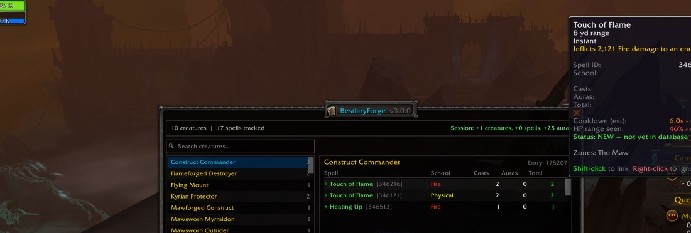
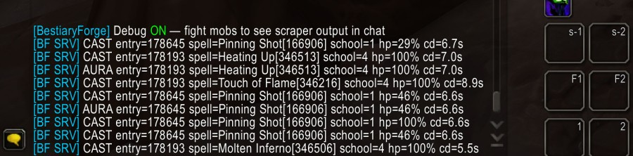

# CreatureCodex

[](https://github.com/VoxCore84/CreatureCodex/releases)
[](LICENSE)

Your NPCs don't fight. They stand there and auto-attack because `creature_template_spell` (the database table that assigns spells to creatures) is empty and there's no SmartAI (TrinityCore's scripted behavior system) telling them what to cast. CreatureCodex fixes that.

**Repository:** [github.com/VoxCore84/CreatureCodex](https://github.com/VoxCore84/CreatureCodex)





## What It Does

1. **Install the addon** on any TrinityCore server — repacks included, no server patches needed
2. **Walk around and let creatures fight** — the addon captures every spell cast, channel, and aura in real time
3. **Open the export panel** and hit the **SmartAI** tab — ready-to-apply SQL with estimated cooldowns, HP phase triggers, and target types
4. **Apply the SQL** — your NPCs now cast spells with proper timing and behavior

CreatureCodex turns observation into working SmartAI. You watch mobs fight, it writes the `smart_scripts` and `creature_template_spell` inserts for you.

### The Full Pipeline

```
                            ┌─ Visual Scraper (client addon, works everywhere)
Walk near mobs / sniff ─────┼─ Server Hooks (C++ UnitScript, 100% coverage)
                            └─ WPP Import (offline, from Ymir packet captures)
                                          │
                                          ▼
                              Browse in-game → Export as SQL
                                                ├── creature_template_spell (spell lists)
                                                ├── smart_scripts (AI with cooldowns)
                                                └── new-only (just the gaps)
```

The SmartAI export isn't just a list of spell IDs — it uses the addon's timing intelligence to estimate cooldowns from observed cast intervals, detects HP-phase abilities (spells only seen below 40% HP get `event_type=2` health triggers instead of timed repeats), and infers target types from cast-vs-aura ratios. It's a first draft you can tune, not a blank slate you have to build from scratch.

## Why This Is Hard Without It

This data doesn't ship in DB2 files. It has to be observed from a live server. In 12.x, that got dramatically harder:

- **`COMBAT_LOG_EVENT_UNFILTERED` is effectively dead.** The combat log was the gold standard for capturing creature casts. In 12.x, cross-addon GUID tracking is severely locked down. Passive CLEU listening no longer gives reliable creature spell data.

- **Taint and secret values.** The 12.x engine injects opaque C++ `userdata` taints into spell IDs, GUIDs, and aura data. Standard Lua `tonumber()`/`tostring()` silently fail on tainted values. Any addon touching spell data must wrap every access in `pcall` with `issecretvalue()` checks or it breaks without warning.

- **Instant casts are invisible.** `UnitCastingInfo`/`UnitChannelInfo` only see spells with visible cast bars. Instant casts, triggered spells, and many boss mechanics never appear in these APIs — a significant portion of any creature's spell list is unobservable from the client.

- **Traditional sniffing is expensive.** The Ymir → WowPacketParser pipeline works but requires dedicated tooling, cache clearing, specific movement patterns (walking = dense data, flying = sparse), and heavy post-processing. Not something you can hand to players and say "go help."

**CreatureCodex works around all of this.** The client-side visual scraper polls cast bars at 10 Hz and scans nameplate auras at 5 Hz, wrapping every access in taint-safe helpers. This works on any server — repacks, custom builds, anything running a 12.x client.

For servers that can add C++ hooks, four `UnitScript` callbacks catch 100% of casts including instant and hidden ones, broadcast as lightweight addon messages. Both layers deduplicate automatically — zero gaps, zero noise.

And if you already have Ymir packet captures, the included Python tool can import WPP output directly — no live server session needed.

## How It Works

CreatureCodex has three data sources:

1. **Client-side visual scraper** (works everywhere, no server patches needed)
   - Polls `UnitCastingInfo`/`UnitChannelInfo` at 10 Hz for spell casts
   - Round-robin scans nameplates for auras at 5 Hz
   - Records spell name, school, creature entry, health %, and timestamps

2. **Server-side sniffer** (requires TrinityCore C++ hooks)
   - Four `UnitScript` hooks broadcast every creature spell event as addon messages
   - Catches 100% of casts including instant/hidden ones the client never sees
   - Broadcasts only to nearby players (100 yd) who have CreatureCodex installed

3. **WPP import** (offline, from Ymir packet captures)
   - Python script parses WowPacketParser `.txt` output
   - Extracts creature entries, spell IDs, schools, and timestamps from SMSG_SPELL_GO / SMSG_SPELL_START / SMSG_AURA_UPDATE
   - Generates `CreatureCodexDB.lua` SavedVariables that the addon loads directly
   - Estimates cooldowns from observed cast intervals

When multiple sources run together, the addon deduplicates automatically — you get complete coverage with zero gaps.

## Download

Grab the latest release from the [Releases page](https://github.com/VoxCore84/CreatureCodex/releases). Download `CreatureCodex.zip` and extract it — it contains everything: the client addon, server scripts, SQL files, tools, and these docs.

## Installation

<details>
<summary><strong>Client-Only Install (No Server Patches)</strong> — click to expand</summary>

If you just want the visual scraper without modifying your server:

1. Copy the `client/` folder contents into your WoW installation's addon folder:
   ```
   <WoW Install>/Interface/AddOns/CreatureCodex/
   ```
   For example: `C:\WoW\_retail_\Interface\AddOns\CreatureCodex\`. Create the `AddOns` folder if it doesn't exist.
2. The folder should contain: `CreatureCodex.toc`, `CreatureCodex.lua`, `Export.lua`, `UI.lua`, `Minimap.lua`, and the `Libs/` folder.
3. Log in. The addon registers automatically via the minimap button (gold book icon).
4. Walk near creatures and observe them fighting — spells are captured in real time.
5. Type `/cc` in chat to open the browser panel and confirm the addon is working.

**What you get**: Visible casts and channels (anything the WoW API can detect).
**What you miss**: Instant casts, hidden spells, and auras applied without visible cast bars.

> **Tip:** If the addon doesn't appear in your addon list, check Game Menu → AddOns → enable **"Load out of date AddOns"** at the top. This is needed when the client version is newer than the addon's TOC Interface version.

</details>

<details>
<summary><strong>Full Install (Server + Client)</strong> — click to expand</summary>

### Prerequisites

- TrinityCore `master` branch (12.x / The War Within)
- C++20 compiler (MSVC 2022+, GCC 13+, Clang 16+)
- Eluna Lua Engine (optional, for spell list queries and aggregation)

### Step 1: Add Core Hooks to ScriptMgr

These four virtual methods must be added to `UnitScript` in your ScriptMgr. If you already have custom hooks, just add these to the existing class.

**`src/server/game/Scripting/ScriptMgr.h`** — Add to `class UnitScript`:
```cpp
// CreatureCodex hooks
virtual void OnCreatureSpellCast(Creature* /*creature*/, SpellInfo const* /*spell*/) {}
virtual void OnCreatureSpellStart(Creature* /*creature*/, SpellInfo const* /*spell*/) {}
virtual void OnCreatureChannelFinished(Creature* /*creature*/, SpellInfo const* /*spell*/) {}
virtual void OnAuraApply(Unit* /*target*/, AuraApplication* /*aurApp*/) {}
```

**`src/server/game/Scripting/ScriptMgr.cpp`** — Add the FOREACH_SCRIPT dispatchers:
```cpp
void ScriptMgr::OnCreatureSpellCast(Creature* creature, SpellInfo const* spell)
{
    FOREACH_SCRIPT(UnitScript)->OnCreatureSpellCast(creature, spell);
}

void ScriptMgr::OnCreatureSpellStart(Creature* creature, SpellInfo const* spell)
{
    FOREACH_SCRIPT(UnitScript)->OnCreatureSpellStart(creature, spell);
}

void ScriptMgr::OnCreatureChannelFinished(Creature* creature, SpellInfo const* spell)
{
    FOREACH_SCRIPT(UnitScript)->OnCreatureChannelFinished(creature, spell);
}

void ScriptMgr::OnAuraApply(Unit* target, AuraApplication* aurApp)
{
    FOREACH_SCRIPT(UnitScript)->OnAuraApply(target, aurApp);
}
```

**`src/server/game/Scripting/ScriptMgr.h`** — Also add these declarations to `class ScriptMgr` (a different class in the same file — search for `class TC_GAME_API ScriptMgr`):
```cpp
void OnCreatureSpellCast(Creature* creature, SpellInfo const* spell);
void OnCreatureSpellStart(Creature* creature, SpellInfo const* spell);
void OnCreatureChannelFinished(Creature* creature, SpellInfo const* spell);
void OnAuraApply(Unit* target, AuraApplication* aurApp);
```

### Step 2: Wire the Hooks into Spell.cpp and Unit.cpp

Add these one-liner hooks at four locations. Search for the function name to find each spot.

**`src/server/game/Spells/Spell.cpp`** — In `Spell::SendSpellGo()`, add at the end of the function (just before the closing `}`):
```cpp
if (Creature* creature = m_caster->ToCreature())
    sScriptMgr->OnCreatureSpellCast(creature, m_spellInfo);
```

**`src/server/game/Spells/Spell.cpp`** — In `Spell::cast()`, add near the top after the null-checks on `m_spellInfo`:
```cpp
if (Creature* creature = m_caster->ToCreature())
    sScriptMgr->OnCreatureSpellStart(creature, m_spellInfo);
```

**`src/server/game/Spells/Spell.cpp`** — In `Spell::SendChannelUpdate()`, find `if (time == 0)` and add inside that block:
```cpp
if (Creature* creature = m_caster->ToCreature())
    sScriptMgr->OnCreatureChannelFinished(creature, m_spellInfo);
```

**`src/server/game/Entities/Unit/Unit.cpp`** — In `Unit::_ApplyAura()`, add at the end of the function (just before the closing `}`):
```cpp
sScriptMgr->OnAuraApply(this, aurApp);
```

### Step 3: Add IsAddonRegistered Helper

The sniffer checks if a player has the `CCDX` addon prefix registered before sending them data. Add this small helper to `WorldSession` (it reads the `_registeredAddonPrefixes` member that already exists in the class):

**`src/server/game/Server/WorldSession.h`** — Add to the `public:` section of `class WorldSession`:
```cpp
bool IsAddonRegistered(std::string_view prefix) const;
```

**`src/server/game/Server/WorldSession.cpp`**:
```cpp
bool WorldSession::IsAddonRegistered(std::string_view prefix) const
{
    for (auto const& p : _registeredAddonPrefixes)
        if (p == prefix)
            return true;
    return false;
}
```

### Step 4: Add RBAC Permission

**`src/server/game/Accounts/RBAC.h`** — Add to the permission enum:
```cpp
RBAC_PERM_COMMAND_CREATURE_CODEX = 3012,
```

Then apply the SQL:
```
mysql -u root -p auth < sql/auth_rbac_creature_codex.sql
```

### Step 5: Copy the Sniffer Scripts

1. Copy `server/Custom/creature_codex_sniffer.cpp` and `server/Custom/cs_creature_codex.cpp` to your `src/server/scripts/Custom/` directory.

2. Register them in `custom_script_loader.cpp`:
   ```cpp
   void AddSC_creature_codex_sniffer();
   void AddSC_creature_codex_commands();

   void AddCustomScripts()
   {
       // ... your existing scripts ...
       AddSC_creature_codex_sniffer();
       AddSC_creature_codex_commands();
   }
   ```

### Step 6: (Optional) Eluna Server Scripts

If you use Eluna, copy `server/lua_scripts/creature_codex_server.lua` to your Eluna scripts directory (default: `lua_scripts/` next to your worldserver binary). This adds:
- **Spell list queries**: Addon can request the full spell list for any creature from `creature_template_spell`
- **Creature info**: Name, faction, level range, classification
- **Zone completeness**: Query all creatures in a map with their known spell counts
- **Multi-player aggregation**: Players can submit discoveries to a shared server-side table

For aggregation, apply the SQL to whichever database you want the shared table in (default: `characters`):
```
mysql -u root -p characters < sql/codex_aggregated.sql
```

If you use a different database, also update `AGGREGATION_DB` at the top of `creature_codex_server.lua` to match.

### Step 7: Build and Install

1. Copy `client/` contents to `Interface\AddOns\CreatureCodex\`.
2. Rebuild your server. From your build directory:
   ```bash
   # CMake + Make (Linux)
   cmake --build . --config RelWithDebInfo -j $(nproc)

   # CMake + Ninja
   ninja -j$(nproc)

   # Visual Studio (Windows)
   # Open the .sln and build in Release or RelWithDebInfo
   ```

</details>

<details>
<summary><strong>WPP Import (Ymir / Sniff Users)</strong> — click to expand</summary>

If you use Ymir to capture packets and WowPacketParser to parse them, you can import creature spell data from `.txt` output files without any live server session.

### Requirements

- Python 3.10+
- WowPacketParser `.txt` output files (parsed from `.pkt` captures). These are the human-readable text files WPP generates — they look like this:
  ```
  ServerToClient: SMSG_SPELL_GO (0x0132) Length: 84 ConnIdx: 0 Time: 01/15/2026 10:23:45.123
  CasterGUID: Full: 0x0000AB1234560001 Type: Creature Entry: 1234 ...
  SpellID: 56789
  ```

### Quick Start

```bash
# Import from one or more WPP text files
python tools/wpp_import.py sniff1.txt sniff2.txt

# Merge into existing addon data (keeps your in-game discoveries)
python tools/wpp_import.py --merge WTF/Account/YOUR_ACCOUNT/SavedVariables/CreatureCodexDB.lua sniff1.txt

# Custom output path
python tools/wpp_import.py --output /path/to/CreatureCodexDB.lua sniff1.txt
```

### What It Parses

The script extracts creature spell data from three WPP opcodes:

| Opcode | What It Captures |
|--------|-----------------|
| `SMSG_SPELL_GO` | Completed spell casts (creature entry, spell ID, school) |
| `SMSG_SPELL_START` | Spell cast starts (same fields) |
| `SMSG_AURA_UPDATE` | Aura applications on creatures |

It also estimates cooldowns from observed cast timestamps — the same data the addon uses for SmartAI export.

### Output

The script generates a `CreatureCodexDB.lua` file in the same format the addon uses for SavedVariables. To load it:

1. Copy the output file to:
   ```
   WTF/Account/<YOUR_ACCOUNT>/SavedVariables/CreatureCodexDB.lua
   ```
2. Log in and `/reload` — the addon picks up the imported data immediately.
3. Browse and export as usual with `/cc` and `/cc export`.

### Tips

- **Walking produces denser data than flying.** When sniffing, walk through areas on foot for better creature spell coverage.
- **Multiple sniffs merge cleanly.** Run the importer with multiple `.txt` files to combine data from different sessions.
- **Merge preserves your work.** Use `--merge` to combine WPP imports with data you've already captured in-game. Cast counts and cooldown estimates are kept from whichever source has more observations.

</details>

## Usage

### Slash Commands

| Command | Description |
|---------|-------------|
| `/cc` or `/codex` | Toggle the browser panel |
| `/cc export` | Open the export panel |
| `/cc debug` | Toggle debug output in chat |
| `/cc stats` | Print capture statistics |
| `/cc zone` | Request zone creature data from server (requires Eluna) |
| `/cc submit` | Submit aggregated data to server (requires Eluna) |
| `/cc reset` | Clear all stored data (with confirmation) |

### GM Commands (requires RBAC 3012)

| Command | Description |
|---------|-------------|
| `.codex query <entry>` | Show all spells for a creature entry |
| `.codex stats` | Show sniffer statistics (online players, addon users, blacklist size) |
| `.codex blacklist add <spellId>` | Add a spell to the runtime broadcast blacklist |
| `.codex blacklist remove <spellId>` | Remove a spell from the blacklist |
| `.codex blacklist list` | Show all runtime-blacklisted spells |

### Export Formats

The export panel offers four tabs:

1. **Raw** — Plain text: `CreatureName (entry) - SpellName [spellId] x castCount`
2. **SQL** — `INSERT INTO creature_template_spell` statements ready to apply
3. **SmartAI** — `INSERT INTO smart_scripts` for AI-driven casting
4. **New Only** — Same as SQL but filters to spells not already in `creature_template_spell`

### Applying the Exported SQL

After exporting from the addon, you have SQL text ready to run against your `world` database. Here are three common ways to apply it:

- **HeidiSQL** (Windows): Connect to your DB, select the `world` database, open a new Query tab, paste the SQL, and hit Execute (F9).
- **phpMyAdmin** (web): Select the `world` database, go to the SQL tab, paste, and click Go.
- **MySQL CLI**:
  ```bash
  mysql -u root -p world < exported_spells.sql
  ```
  Or paste directly into an interactive `mysql` session after running `USE world;`.

The SQL and SmartAI exports include `DELETE` + `INSERT` pairs so they're safe to re-run — they won't create duplicates.

### Minimap Button

Left-click opens the browser. Right-click opens export. The minimap button can be dragged to reposition.

## Protocol Reference

The addon and server communicate over the `CCDX` addon message prefix using pipe-delimited messages:

| Direction | Code | Format | Purpose |
|-----------|------|--------|---------|
| S->C | `SC` | `SC\|entry\|spellID\|school\|name\|hp%` | Spell cast complete |
| S->C | `SS` | `SS\|entry\|spellID\|school\|name\|hp%` | Spell cast started |
| S->C | `CF` | `CF\|entry\|spellID\|school\|name\|hp%` | Channel finished |
| S->C | `AA` | `AA\|entry\|spellID\|school\|name\|hp%` | Aura applied |
| C->S | `SL` | `SL\|entry` | Request spell list |
| C->S | `CI` | `CI\|entry` | Request creature info |
| C->S | `ZC` | `ZC\|mapId` | Request zone creatures |
| C->S | `AG` | `AG\|entry\|spellId:count,...` | Submit aggregated data |

## File Structure

```
CreatureCodex/
  client/
    CreatureCodex.toc        -- Addon TOC
    CreatureCodex.lua         -- Core engine (capture + DB)
    Export.lua                -- 4-tab export panel
    UI.lua                   -- Browser panel
    Minimap.lua              -- LibDBIcon minimap button
    Libs/                    -- LibStub, CallbackHandler, LibDataBroker, LibDBIcon
  server/
    Custom/
      creature_codex_sniffer.cpp   -- C++ UnitScript hooks (broadcast layer)
      cs_creature_codex.cpp        -- .codex GM command tree
    lua_scripts/
      creature_codex_server.lua    -- Eluna handlers (spell lists, aggregation)
  sql/
    auth_rbac_creature_codex.sql   -- RBAC permission for .codex command
    codex_aggregated.sql           -- Multi-player aggregation table
  tools/
    wpp_import.py                  -- WowPacketParser → SavedVariables importer
  screenshots/                     -- README screenshots
  README.md                        -- This file
  README_RU.md                     -- Russian translation
  README_DE.md                     -- German translation
```

## License

MIT. Libraries in `Libs/` retain their original licenses.
